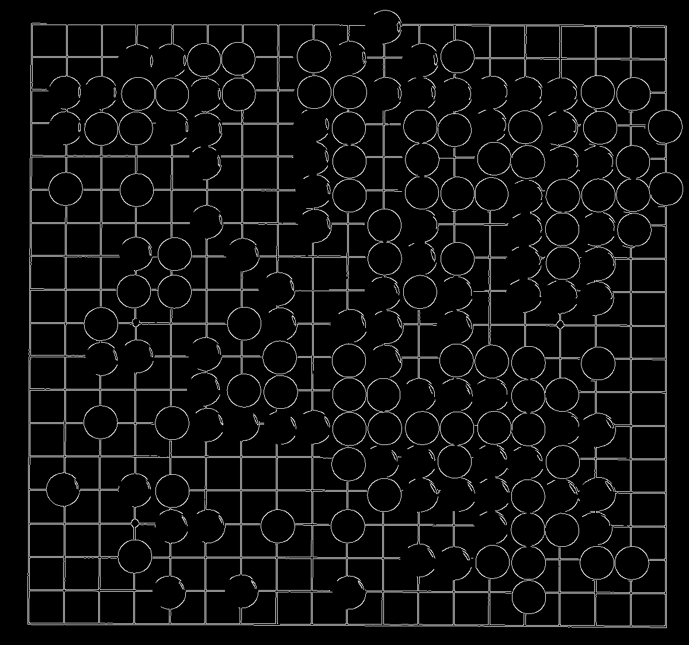
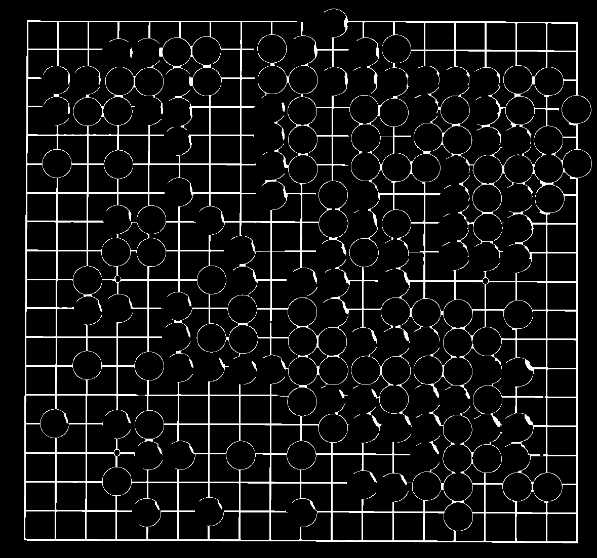
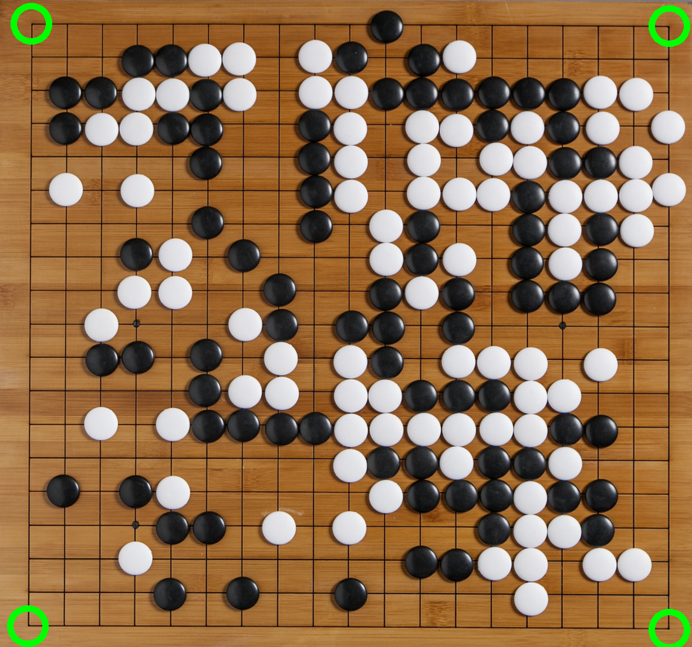
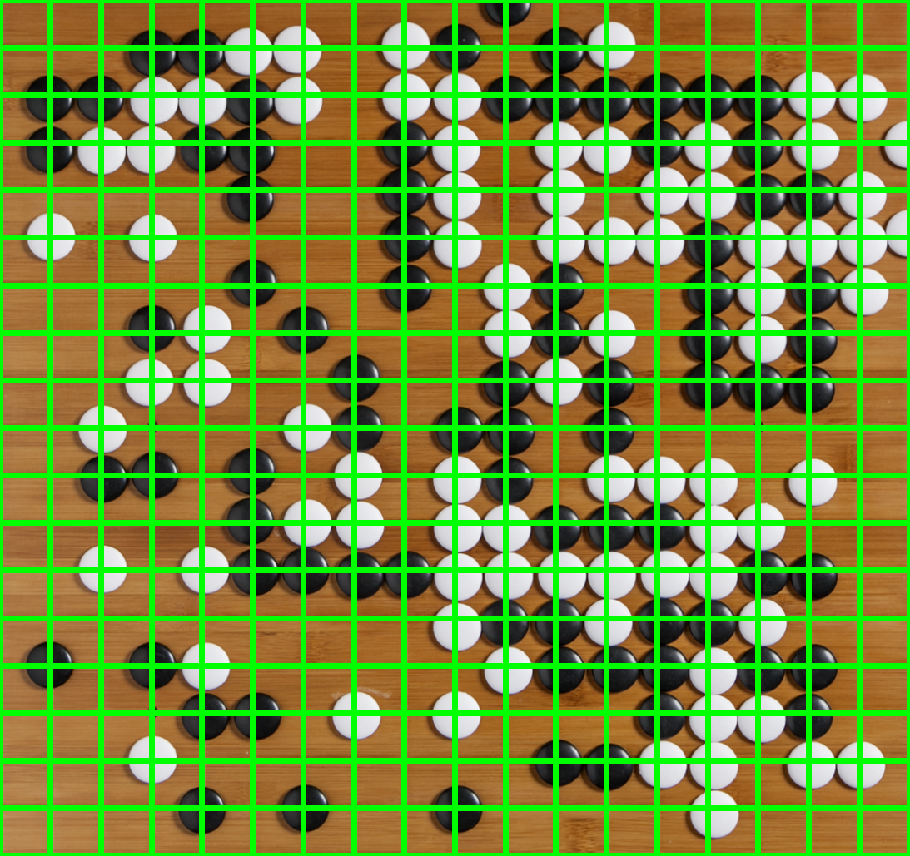
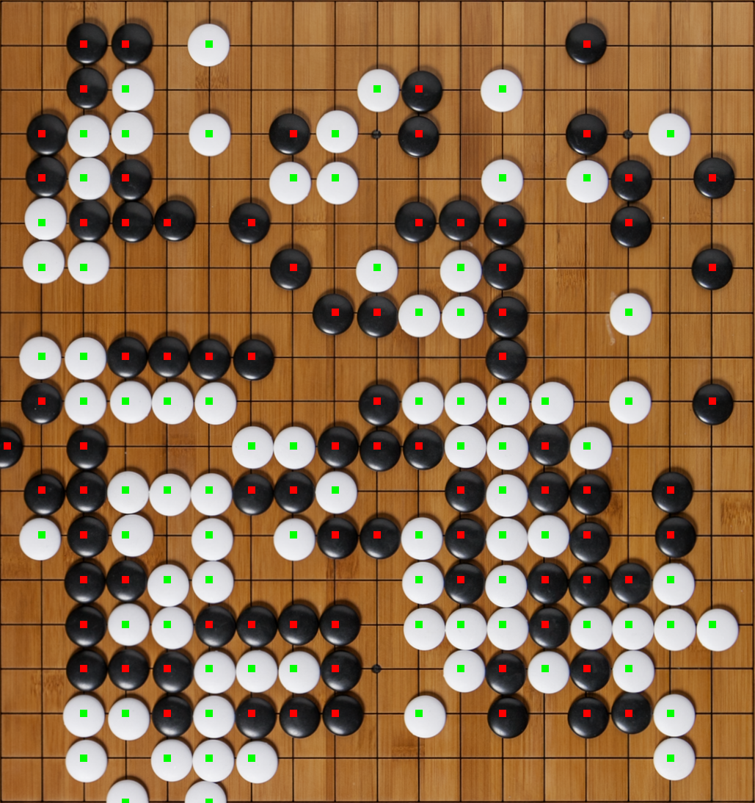

# GoDetector

### About

As a very new Go player, I found it tedious to properly score my games by area when I would play over the board. I made this project to try to make my life ever so slightly easier, but also to try out OpenCV on a project with practical use.

### Methodology

##### 1. Identifying the Playing Area

The first challenge in analyzing a Go board is orienting yourself and giving yourself a nice flat image. To do this we need to identify the corners of the play area. First I use [canny edge detection](edges.png) on a grayscale version of the input image. I then clean up the image by using [dilation and erosion](erosion.png) to give us a sleek outline of th eplay area. Next we can identify the corners by finding the white pixel that is closest to each corner of the image and use these points to [crop our image](transformedPerspective.png) with our new corners, thus giving us a flat, top-down view of our playing area.

   

##### 2. Constructing the Intersections

With an image whose dimmensions directly respresent the playing area of the Go board and the given size of the game board, _S_ (19x19 by default), we can easily identify each playable space on the board by drawing _S_ equidistant lines vertically and horizontally and record their locations. This results in a grid that perfectly reflects the [board intersections](lines.png).

##### 3. Clustering Black, White, and Empty Spaces

The next task is to be able to identify whether each intersection is occupied by a black tile, a white tile, or no tile at all. To do this, we iterate through each intersection and find the average color value of a 20x20 area of pixels. All of these color values are then given to a KMeans algorithm and separated into three clusters and store the BGR value of those cluster centers. Next, we sort the clusters based on the sum of B+G+R and designate the lowest value to Black (closest to [0,0,0]), the highest value to white (closest to [255,255,255]), and the middle value is assumed to represent empty spaces. The [state of each intersection](colors.png) can now be determined and we are left with data representing the board state which is ready to be scored.

##### 4. Scoring

The Go board is finally able to be scored using the tenuki.js library as I was unable to find a python library that would do the trick.
